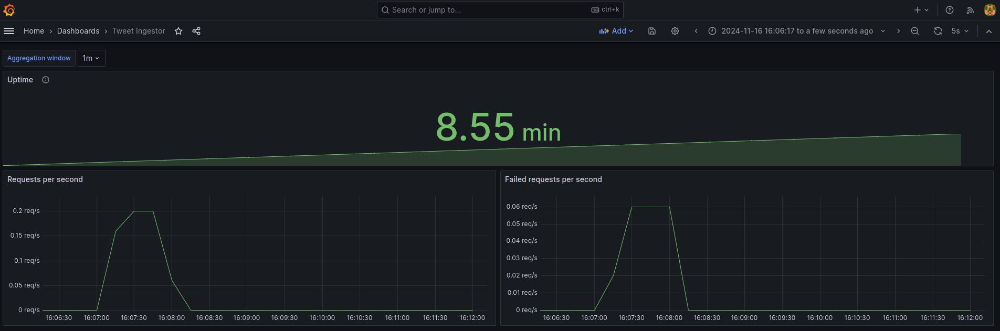

# tweet-ingestor
Microservice for receiving tweets and storing them on a kafka topic

## Running the service
To run the service, run the script:
```
./scripts/run.sh
```

### Create a Kafka cluster, Prometheus service, and Grafana service
To start all the necessary services, run the following command:
```
docker-compose up -d
```

### Sending a simple tweet
To send a simple tweet, execute the script:
```
./scripts/send-tweet.sh
```

## Metrics
Metrics are scraped using Prometheus and visualised on a Grafana dashboard. These are all installed as part of the docker-compose setup. The metrics and grafana dashboard provide the user with the ability to see the requests per second to the service and the failed requests per second.

### Metrics Dashboard Screenshot

